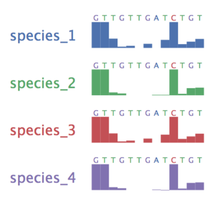
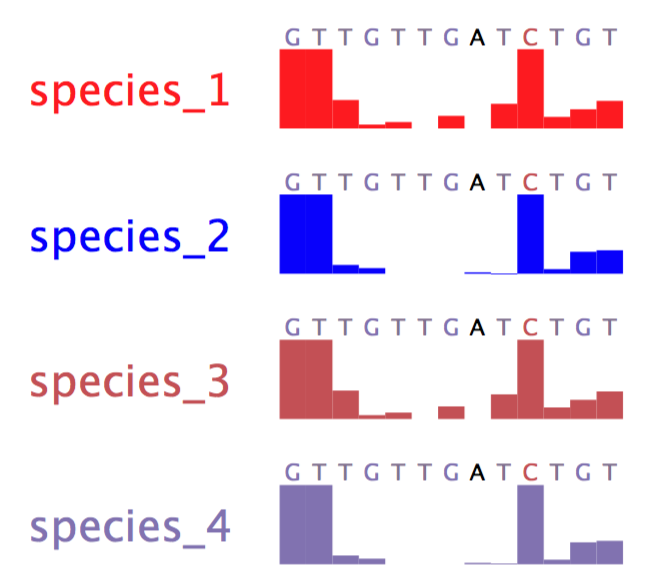
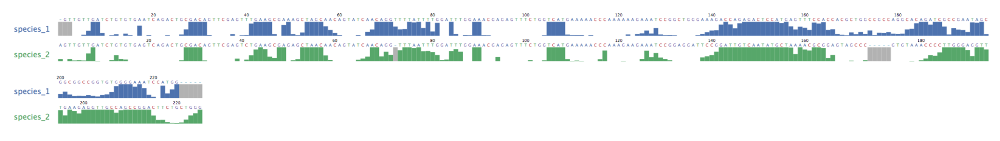

<center>
##align_plot
</center>

### Usage:

```
[lee@MacBook-Pro-2 align_plot]$ bin/align_plot_mac

align_plot: a programe to plot icSHAPE score of mutiple aligned species...
==========================================================================
align_plot [options] align_file shape_file out_pdf_file

options:
         --baseColor <string>: A:#4C72B0/T:#55A868/C:#C44E52/G:#8172B2/-:#64B5CD
         --shapeColor <string>: KU501215.1:#55a868/AY632535.2:#c44e52

         Version: 1.0.0
         Version: 2017-10-17
         AUTHOR: Li Pan
```

### Examples:

```shell
bin/align_plot_mac examples/multi.align examples/multi.shape examples/multi.pdf
```
<center>

</center>

```shell
bin/align_plot_mac \
					--baseColor A:black/T:#827191 \
					--shapeColor species_1:red/species_2:blue \
					examples/multi.align \
					examples/multi.shape \
					examples/multi.pdf
```
<center>

</center>

#### Long Sequence and NULL Value is permited

```shell
bin/align_plot_mac examples/long.align examples/long.shape examples/long.pdf
```
<center>

</center>
